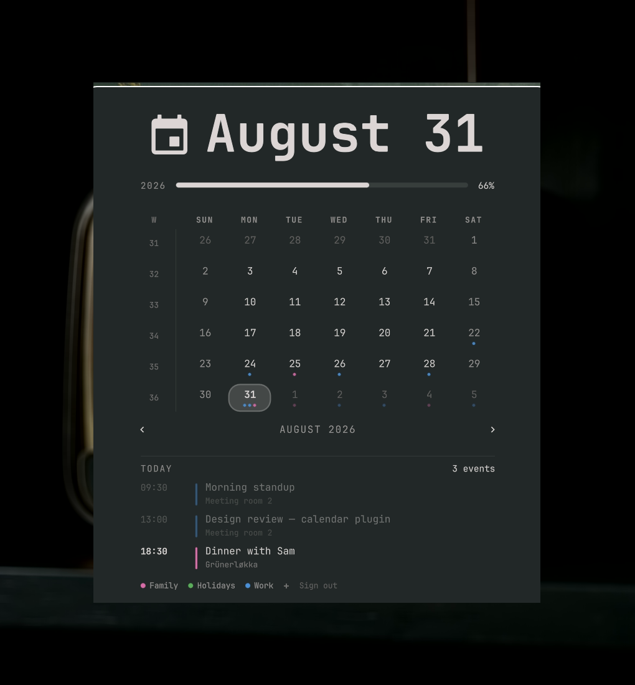
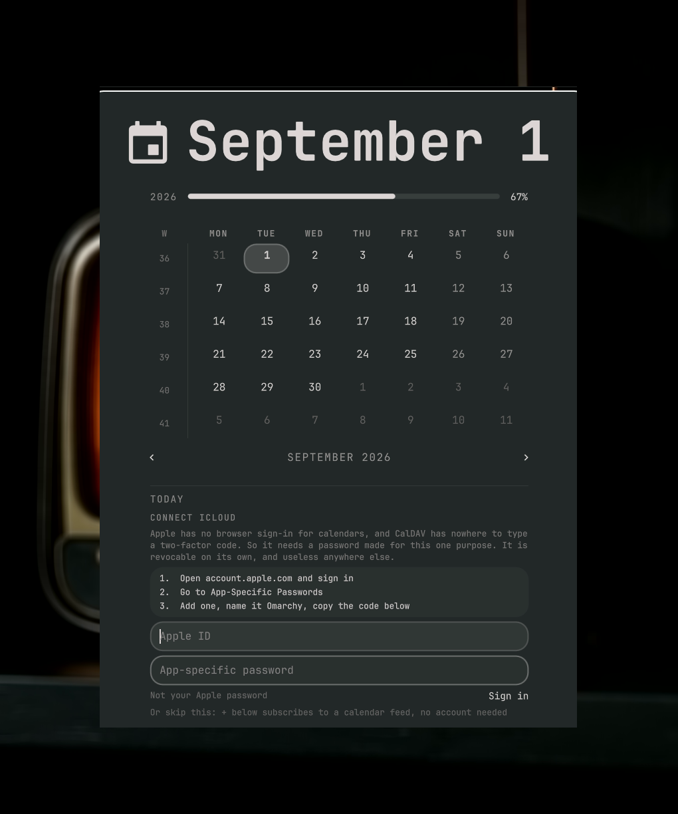
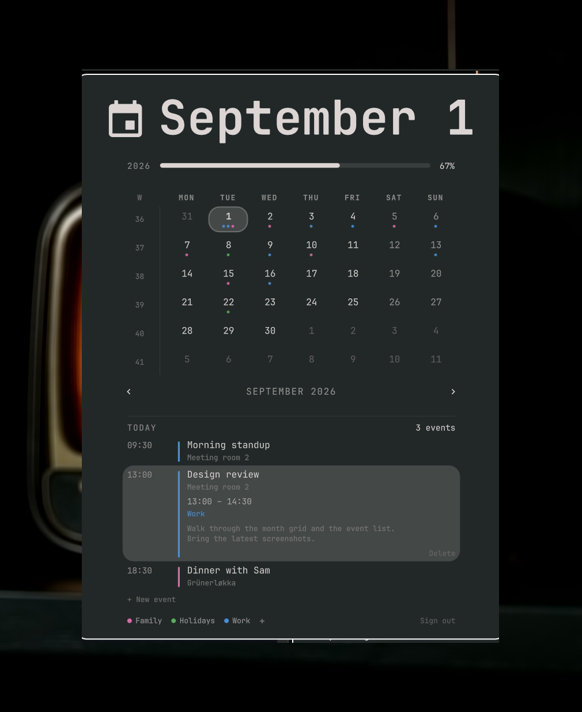
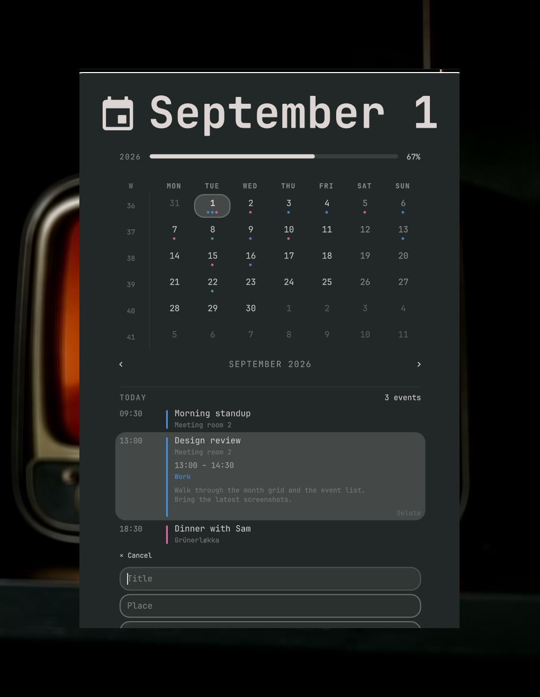

# Omadates

Apple Calendar in your Omarchy bar.

Days that have something on them carry a dot in the calendar popup, coloured
by which calendar it belongs to. Today's events sit under the month grid, and
clicking one opens it up: when it ends, where it is, and whatever notes came
with the invitation. The popup grows a line per event rather than scrolling a
fixed box.

Works with **iCloud**, any **CalDAV** server (Fastmail, Nextcloud, Radicale),
and **webcal subscriptions**: the holiday and timetable feeds your phone
carries but iCloud never stores.



## Install

```bash
omarchy pkg add python-caldav python-icalendar python-recurring-ical-events python-httpx libsecret
omarchy plugin add https://github.com/Gabbe2312/omadates.git --enable
```

The packages are separate because a plugin cannot install system packages for
you. If you skip them, the panel tells you exactly which line to run.

`--enable` puts it in the centre of the bar, beside Omarchy's own clock. Open
this one and it offers to take that one off the bar for you. The stock clock
stays installed, so `omarchy bar put omarchy.clock --section center` brings it
back whenever you want it.

Omarchy pins one centre widget in place and hangs the rest off its edges, so
things that appear on hover grow outward instead of shoving the clock
sideways. That pin, `bar.centerAnchor` in `shell.json`, ships pointing at
the stock clock, and switching it off leaves it dangling. This plugin takes
the pin over on first load when it finds it that way. It leaves an anchor
that still resolves alone, and never claims a blank one, since blank means
"centre the whole row" on purpose.

## Updating

```bash
omarchy plugin update io.github.gabbe2312.calendar --yes
omarchy restart shell
```

Omarchy shows you the incoming diff and asks before it installs anything,
which is worth reading at least once; `--yes` skips that. The restart is the
part that is easy to miss: the update reloads the plugin registry but not QML
already loaded into the running shell, so without it the old panel stays on
screen and the update looks like it did nothing.

## Signing in

Optional. A subscribed feed works on its own, so if all you want is a
timetable or a holiday calendar, skip to the next section.

You need an **app-specific password**, not your normal Apple password. Apple
offers no browser sign-in for calendar access, and CalDAV has nowhere to type
a two-factor code, so this is the supported way in. It is revocable on its
own and useless anywhere else.

1. Open **account.apple.com** and sign in
2. Go to **App-Specific Passwords**
3. Add one, name it *Omarchy*, and copy the code

Then open the clock in the bar and enter your Apple ID and that code. The
panel spells these steps out too, and clicking them opens the page.



The password goes straight to your login keyring. Revoke it at Apple any time
without touching anything else.

It never lands in a config file, is never passed as a command-line argument,
and reaches the sync helper on stdin.

## Adding a calendar

`+` at the end of the calendar row asks which kind you mean.

**A new calendar** is made on your account, so it appears on your phone and
everywhere else you are signed in, and events can be written to it. Name it,
pick a colour, done.

**A subscribed feed** is somebody else's file, read from a URL. It cannot be
written to, and its colour is a local note rather than something the server
keeps.

## Subscribed calendars

iCloud does not store `webcal://` subscriptions. Your phone keeps only the
URL and fetches the feed itself, so they have to be added here too. Press the
`+` at the end of the calendar row and paste the URL.

Find it on iPhone under **Settings → Apps → Calendar → Accounts → Subscribed
Calendars**, or on a Mac in Calendar under **File → Get Info**.

## Using it

| | |
|---|---|
| Click a day | Show that day's events |
| Click an event | Open its details |
| Click the address in an open event | Open it in maps |
| `+ New event` | Add one to the day you are looking at |
| `Delete` in an open event | Remove it; press twice to confirm |
| Click a calendar | Hide or show it |
| Right-click a calendar | Rename it, recolour it, or remove it |
| Right-click the year bar | Put the year meter away; the hairline it leaves behind brings it back |
| `+` | Make a calendar, or subscribe to a feed |
| Scroll / `[` `]` | Previous and next month |
| `{` `}` | Previous and next year |
| `t` | Back to today |
| Click the `W` heading | Start weeks on Monday, or on Sunday |
| `w` | The same, from the keyboard |

Clicking an event opens the half the list leaves out: when it ends, which
calendar it came from, and whatever notes the invitation carried.



Weeks start wherever your system locale says they do until you say otherwise,
which for an `en_US` locale means Sunday even in a country that does not.
Clicking the `W` settles it for good.

Recolouring a calendar your account owns sets its colour on the server, so it
changes on your phone and everywhere else too. A subscribed feed cannot take
one, so there the colour stays a local note with a way back to whatever the
feed publishes.

Removing one is asked for twice, with what it costs written out in between.
Deleting a calendar your account owns takes it and everything in it off the
server, on every device. Dropping a subscription only forgets a URL: whoever
publishes it is unaffected, and pasting the address back brings it here again.

Renaming is always local, stored next to the widget in `shell.json`. A sync
never overwrites it, and the calendar's original name stays its identity
underneath.

Everything the stock Omarchy clock does is still there: the label formats on
right-click, the year bar, the timezone picker, memento mori.

## Adding an event

`+ New event` under the day's list. The grid is the date picker: whichever day
you are looking at is the day it lands on, so the form asks only for what the
calendar cannot already tell it.



Times are typed rather than picked, and read loosely: `9`, `0900`, `09.30` and
`21:45` all work. An end at or before the start runs into the next day, marked
`+1` beside the field rather than decided quietly.

Only calendars your account owns are offered. A subscribed feed is read-only
by nature, and a reminder list holds a different kind of thing, so neither
appears in the picker.

It goes straight to the server, which means it reaches your phone the same way
an event made on a Mac does.

Open an event and `Delete` removes it, on a second press rather than a first.
A repeating event says `Delete every one?` instead, because a series shares
one identifier and there is no way to take less than all of it from here.

## How it syncs

The shell never touches the network. A helper writes
`~/.cache/omarchy/omadates/events.json`, and the panel watches that one file
and redraws. So the popup opens instantly, and it still shows the last good
answer when you are offline.

Opening the panel asks the server whether anything changed, and every five
minutes the shell asks again in the background. That question
is answered by a sync token: an opaque string per calendar that changes when
its contents do, so the server does the comparing and the answer costs a
fifth of a second. Only when it comes back different is anything fetched. An
event added on your phone is there the moment you look, and within five
minutes even if you do not.

Nothing outside the panel shows an event, so a check nobody is waiting on
buys little. Asking every minute would cost almost no CPU — a sixth of a
second of work — but would wake the radio 1440 times a day for a calendar
you open maybe ten times, and that is the real price on a laptop.

A full pass still runs every quarter of an hour, because subscribed feeds
carry no such token and a plain sweep repairs anything the tokens missed. No
system timer to install for either.

Set `pollSeconds` on the widget in `shell.json` to change the background
interval, or to `0` to leave only the quarter-hour pass. Opening the panel
always asks, whatever it is set to.

## Configuration

`~/.config/omarchy/omadates/config.json`:

| Key | Meaning |
|---|---|
| `url` | CalDAV endpoint. Defaults to iCloud; Fastmail, Nextcloud and Radicale work the same way. Must be `https://`. |
| `username` | Your account. Set by signing in. |
| `daysBack` / `daysAhead` | How much of the calendar to keep cached. |
| `calendars` | Only fetch these calendar names. Empty means all of them. |
| `subscriptions` | Feed URLs, managed by the `+` button. |

The helper is also a small CLI, if you would rather script it:

```bash
bin/omadates-sync            # refresh now
bin/omadates-sync check      # report missing packages
bin/omadates-sync subscribe <url>
bin/omadates-sync logout
bin/omadates-sync map "Pilestredet 32, Oslo"
```

The map opens through your registered `geo:` handler, so it lands in whichever
map you have chosen; Omarchy ships handlers for Google Maps, OpenStreetMap and
Wheelmap. A system with none falls back to a web search.

It reuses the browser you already have open rather than starting another, and
brings that window to you if it is sitting on a different workspace. A tab
opening two desks away is the same as nothing happening.

## What it touches

A calendar plugin reads your diary, holds a password and talks to servers you
name, so here is the whole of what that means in one place.

**Where it connects.** Your CalDAV server, and the feed URLs you paste.
Nothing else, ever. Both must be `https://`; `webcal://` is rewritten to it.
A feed's redirects are followed one at a time and each hop is checked, so a
feed cannot send the fetch to this machine's own loopback, to the link-local
range that holds cloud metadata services, or into the network behind your
router. What comes back is read up to a limit rather than to whatever length
the far end feels like sending. DNS-based server discovery is off: the
address is one you already have, and a DNS answer does not get to nominate
somewhere else to send the password.

**The password.** Straight to your login keyring through `secret-tool`, on
stdin. Never in a config file, never as a command-line argument, never in the
process list. It is checked against the server before it is stored, so a typo
on re-authentication cannot replace a working credential with a broken one.

**On disk.** `~/.config/omarchy/omadates/` and `~/.cache/omarchy/omadates/`
are `0700`, and the files in them `0600`. Between them they hold your Apple
ID and the title, place and notes of everything on your calendar, which is
nobody else's business on a shared machine. Every write goes to a temporary
file that refuses to be a symlink and is then renamed into place, so the
panel never reads half a cache and nothing here can be tricked into writing
through a link somewhere else.

**On screen.** Everything that came off a server is drawn as plain text.
Titles and places are cut to a line's worth and stripped of control
characters and the bidirectional overrides that make text render backwards,
so no event can rearrange the panel or make its title read as something it is
not.

**Writes.** Creating and deleting events and calendars, and setting a
calendar's colour, all go to the server. Every destructive action asks twice
and says what it costs first. A subscribed feed is somebody else's file and
nothing here can write to one.

**Processes.** The panel runs one helper: the `bin/omadates-sync` beside it.
Each call has a network timeout, only one of each kind runs at a time, and
anything still going after forty seconds is stopped and reported rather than
left holding a connection open for the life of the shell.

## Removing it

```bash
omarchy plugin remove io.github.gabbe2312.calendar
rm -rf ~/.config/omarchy/omadates ~/.cache/omarchy/omadates
secret-tool clear service io.github.gabbe2312.calendar
```

## Credits

The clock, month grid and week numbering are Omarchy's own, MIT-licensed and
lightly reshaped to make room for events. See `LICENSE`.

Plugins run unsandboxed, as arbitrary code inside your shell process. Read
what you install, this one included.
